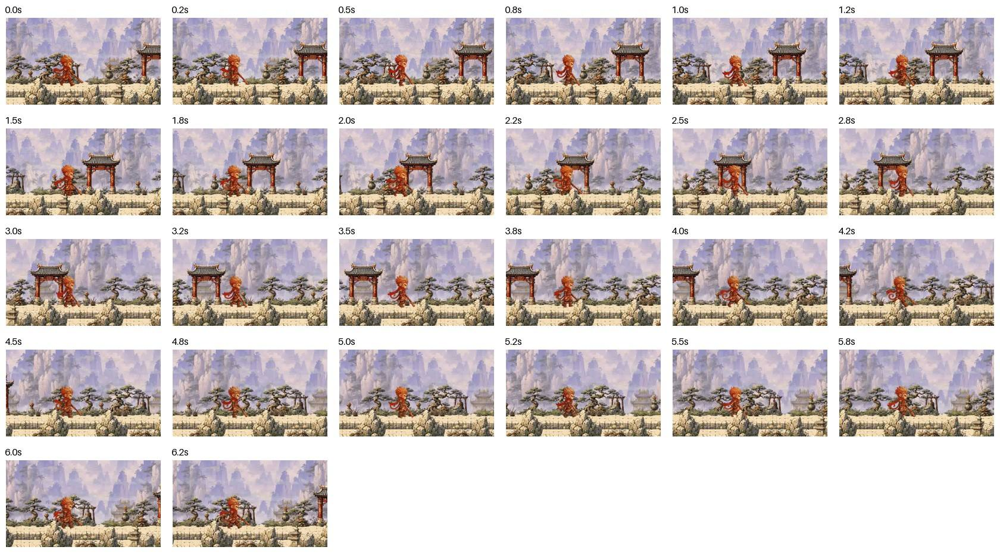

# video-frame-review

Turn a video into sampled JPEG frames plus **labelled contact sheets**, so an AI
agent can inspect a recording without playing it back.

The sheets are the point. Frames get tiled onto a grid with the wall-clock
timestamp burned into each tile, so **one image covers 36 seconds** instead of
one image per moment. An agent reading a sheet can tell you the button goes grey
at 00:22. It has the timeline, not just a still.

## Why this exists

It started as a game-art problem. I was building a small 2D platformer and kept
hitting the same wall: I could *see* that a jump felt wrong, but I could not hand
that to an agent. Video is the honest record of how something moves, and the
agent I was working with could not open one. So the conversation degenerated into
me exporting stills one at a time and describing what happened between them.

The first version just dumped frames to PNGs. It helped, but reviewing a clip
still cost one image read per frame, and every frame arrived with no idea *when*
it was. That is exactly the information you need when the bug is "it stutters
about a third of the way in."

Tiling the frames and printing the timestamp on each one fixed both at once.

That game did not end up continuing. The tool outlived it, because the underlying
problem was not specific to games: **any time the evidence is a recording and
your agent cannot take it in that form, you are stuck narrating it.** Screen
recordings of a bug, a simulator capture, an animation review, a clip someone
sent you. Same fix every time.

Agent video support varies by vendor and keeps moving, so this is not a claim
about what any particular model can do. Frames on a labelled grid work
everywhere, which is the point: it is one image read, in a format nothing has
trouble with.

## Setup

```bash
python3 -m venv .venv && .venv/bin/pip install -r requirements.txt
```

Also needs **`ffmpeg` on your `PATH`** (`ffprobe` is optional, used only to
print an estimated frame count before it starts).

## Usage

```bash
python3 video_frame_review.py "recording.mp4"
```

Output goes to a sibling folder named after the video:

```text
recording_review_1p0fps/
  frames/     frame_0001.jpg, frame_0002.jpg, ...
  sheets/     sheet_0001_0036.jpg, sheet_0037_0072.jpg, ...
```

Hand the agent the **sheets**. Reach for individual `frames/` only when you need
one moment at full resolution.

There is no format restriction. The input goes straight to `ffmpeg -i`, so
`.mov`, `.mp4`, `.m4v`, `.webm`, `.mkv`, `.avi`, `.gif` and PNG sequences all
work.

## Worked example

A 6.5-second clip of a walk cycle from that platformer. The exact kind of thing
that is impossible to describe in words and obvious in a grid.

```bash
python3 video_frame_review.py walkcycle.mp4 --fps 4
```

```text
walkcycle.mp4: 6.5s, extracting about 26 frames
frames: 26 -> walkcycle_review_4p0fps/frames
sheets: 1 -> walkcycle_review_4p0fps/sheets  (tile 280x186)
walkcycle_review_4p0fps/sheets/sheet_0001_0026.jpg
```

That one sheet is the whole clip:



Now paste that single image into your agent and ask a real question. Because the
timestamps sit on the tiles, the answers come back anchored to the clip: you can
see the character cross the scene left to right, watch the background scroll with
it, and point at the exact tile where the stride stops looking right. Getting to
that same observation used to mean 26 separate image pastes and me narrating the
gaps between them.

Note the tiles are landscape here because the footage is. Feed it a phone
recording and they come out portrait, no flags needed.

## Already have the stills?

Point it at a **directory** instead of a video and it sheets what's on disk, no
ffmpeg needed:

```bash
python3 video_frame_review.py ./screenshots/
```

Tiles get labelled with filenames rather than timestamps, since a folder has no
timeline. Useful for a batch of generated images, a screenshot run, or frames
some other tool already exported. Same reason as the video case: a folder of 40
images costs 40 image reads until they're on one grid.

### Useful options

```bash
python3 video_frame_review.py input.mp4 --fps 2 --max-frames 120
python3 video_frame_review.py input.mp4 --out-dir review --columns 5 --rows 5
python3 video_frame_review.py input.mp4 --width 720 --tile-width 320
python3 video_frame_review.py input.mp4 --gif        # also write a shareable GIF
```

- `--fps` (default `1`): samples per second. Raise it for motion detail; timestamps
  gain tenths automatically above 1 fps. This is the knob you'll actually tune.
- `--max-frames`: stop early. Worth setting on a long recording before you find out
  how many sheets it wanted to write.
- `--columns` / `--rows` (default `6`x`6`): tiles per sheet. Fewer, larger tiles read
  more clearly if the detail you care about is small text.
- `--tile-height`: normally leave it alone. Tile height follows the footage's own
  aspect ratio, so portrait and landscape both fill their tiles.
- `--gif`: animated GIF alongside the frames, for a devlog or a message thread.

## Notes

- **A short final sheet is trimmed to the rows it fills.** Blank rows are not free:
  most agents downscale a large image before reading it, so empty space costs you
  the resolution you wanted spent on pixels.
- **36 tiles per sheet stays legible** after that downscale, including burned-in
  video captions. Verified, not assumed. If your subject is finer than that (small
  UI labels, code in a screen recording), drop to `--columns 4 --rows 3`.
- **1 fps is a deliberate default.** Most review questions are "what changed and
  roughly when", and one frame per second answers that at a thirtieth of the frames.
  Motion questions ("does this loop cleanly?") want `--fps 4` or higher.
- Frames are JPEG, so a two-minute recording costs a few MB rather than hundreds.

MIT. Adapt freely.
